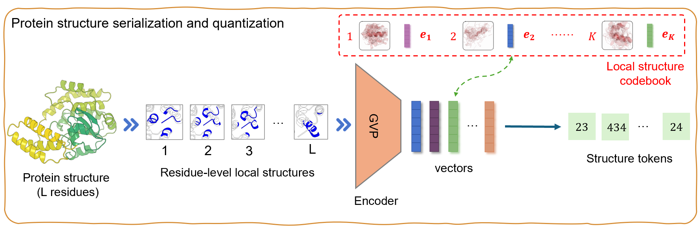

# ProSST
<!-- select Model and/or Data and/or Code as needed>
### Welcome to OpenMEDLab! 👋


<!-- Insert the project banner here -->
<div align="center">
    <a href="https://"></a>
</div>

---


## Key Features

This repository provides the official implementation of ProSST: A Pre-trained Protein Sequence and Structure Transformer with Disentangled Attention.

The paper introduces several key contributions to protein language modeling:

1. **Integration of Protein Sequences and Structures:**
   The ProSST model integrates both protein sequences and structures using a structure quantization module and a Transformer architecture with disentangled attention, effectively capturing the relationship between protein residues and their structural context.

2. **Structure Quantization Module:**
   This module converts 3D protein structures into discrete tokens by serializing residue-level local structures and embedding them into a dense vector space, which are then quantized using a pre-trained clustering model to serve as effective protein structure representations.

3. **Disentangled Attention Mechanism:**
   ProSST uses a disentangled attention mechanism to explicitly learn the relationships between protein sequence tokens and structure tokens, improving the model’s ability to capture complex features of protein sequences and structures, and leading to state-of-the-art performance in various protein function prediction tasks.

## Links

- [Paper](https://www.biorxiv.org/content/10.1101/2024.04.15.589672v2)
- [Model](https://huggingface.co/AI4Protein/ProSST-2048)
- [Code](https://github.com/ai4protein/ProSST)


## Details

intro text here.

<!-- Insert a pipeline of your algorithm here if got one -->
<div align="center">
    <a href="https://"></a>
</div>

More intro text here.


## Dataset Links

**ProteinGYM Benchmark** 

Download the dataset from [Google Drive](https://drive.google.com/file/d/1lSckfPlx7FhzK1FX7EtmmXUOrdiMRerY/view?usp=sharing).

## Get Started

**Installation**

```shell
git clone https://github.com/ginnm/ProSST.git
cd ProSST
pip install -r requirements.txt
export PYTHONPATH=$PYTHONPATH:$(pwd)
```

**Structure quantizer**

```python
from prosst.structure.quantizer import PdbQuantizer
processor = PdbQuantizer(structure_vocab_size=2048) # can be 20, 128, 512, 1024, 2048, 4096
result = processor("example_data/p1.pdb", return_residue_seq=False)
```

Output:

```shell
[407, 998, 1841, 1421, 653, 450, 117, 822, ...]
```

**Download Model**

ProSST models have been uploaded to huggingface 🤗 Transformers

```python
from transformers import AutoModelForMaskedLM, AutoTokenizer
model = AutoModelForMaskedLM.from_pretrianed("AI4Protein/ProSST-2048", trust_remote_code=True)
tokenizer = AutoTokenizer.from_pretrained("AI4Protein/ProSST-2048", trust_remote_code=True)
```

See [AI4Protein/ProSST-*](https://huggingface.co/AI4Protein?search_models=ProSST) for more models.


## Zero-shot mutant effect prediction

### Example notebook
[Zero-shot mutant effect prediction](zero_shot/score_mutant.ipynb)

### Run ProteinGYM Benchmark
Download dataset from [Google Driver](https://drive.google.com/file/d/1lSckfPlx7FhzK1FX7EtmmXUOrdiMRerY/view?usp=sharing).
(This file contains quantized structures within ProteinGYM).

```shell
cd example_data
unzip proteingym_benchmark.zip
```

```shell
python zero_shot/proteingym_benchmark.py --model_path AI4Protein/ProSST-2048 \
--structure_dir example_data/structure_sequence/2048
```


## 🛡️ License

This project is under the GPL-3.0 license. See [LICENSE](LICENSE) for details.


## 📝 Citation

If you find this repository useful, please consider citing this paper:
```
@article {Li2024.04.15.589672,
	author = {Li, Mingchen and Tan, Yang and Ma, Xinzhu and Zhong, Bozitao and Zhou, Ziyi and Yu, Huiqun and Ouyang, Wanli and Hong, Liang and Zhou, Bingxin and Tan, Pan},
	title = {ProSST: Protein Language Modeling with Quantized Structure and Disentangled Attention},
	elocation-id = {2024.04.15.589672},
	year = {2024},
	doi = {10.1101/2024.04.15.589672},
	publisher = {Cold Spring Harbor Laboratory},
	URL = {https://www.biorxiv.org/content/early/2024/05/17/2024.04.15.589672.1},
	eprint = {https://www.biorxiv.org/content/early/2024/05/17/2024.04.15.589672.1.full.pdf},
	journal = {bioRxiv}
}
```

